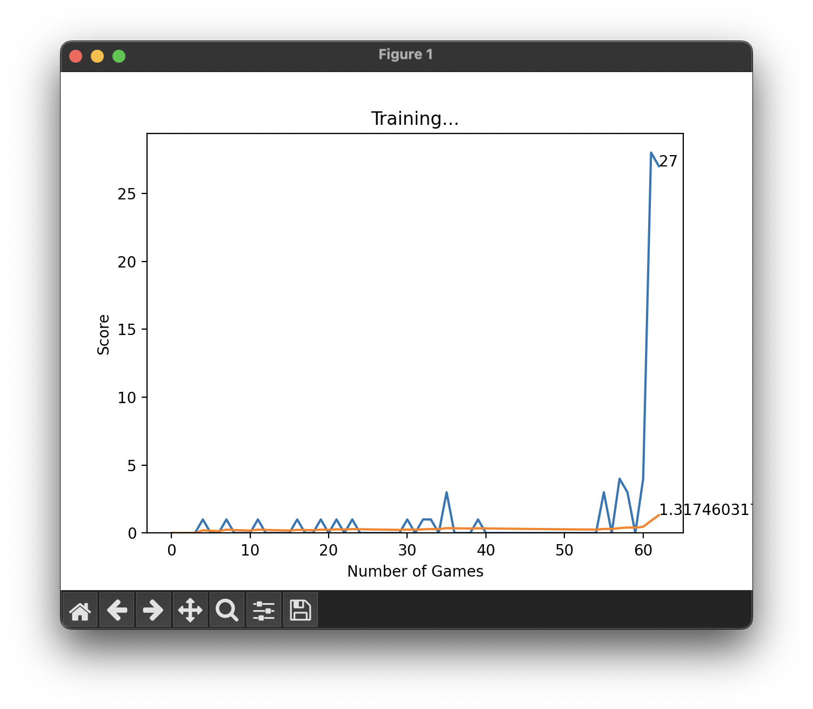

# Snake Game AI with Deep Learning

This project implements an AI agent to play the classic Snake game using Deep Learning. The agent learns to navigate the game board, avoiding collisions with walls and its own body while aiming to eat the food to grow longer.

## Agent Training Video


## Training Chart



The training chart above illustrates the progress of the AI agent during training, showing how the score improves over time.

## Getting Started

1. Clone this repository:

    ```bash
    git clone https://github.com/YOUR_USERNAME/snake-game-ai.git
    ```

2. Train the AI agent:

    ```bash
    python train.py
    ```

## Project Structure

- `train.py`: Script to train the AI agent.
- `game.py`: Implements the Snake game environment logic.
- `model.py`: Defines the neural network model.
- `helper.py`: Provides helper functions for visualization and plotting.
- `README.md`: Project documentation.
